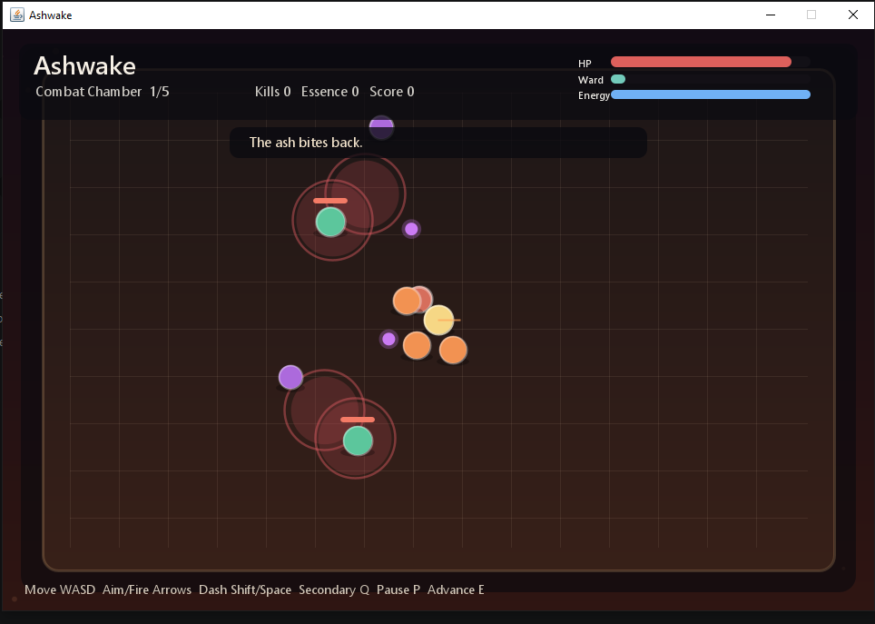
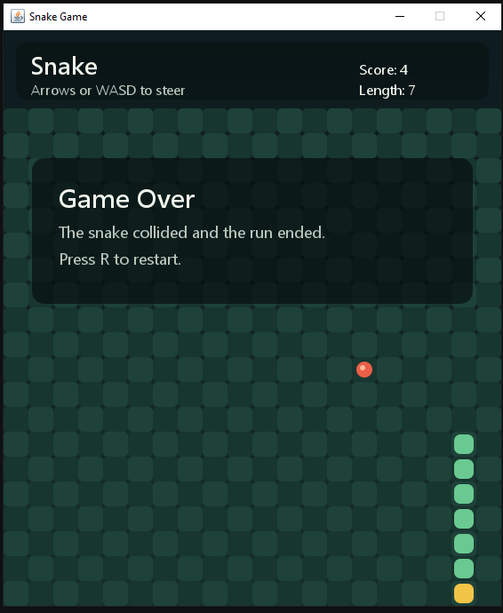
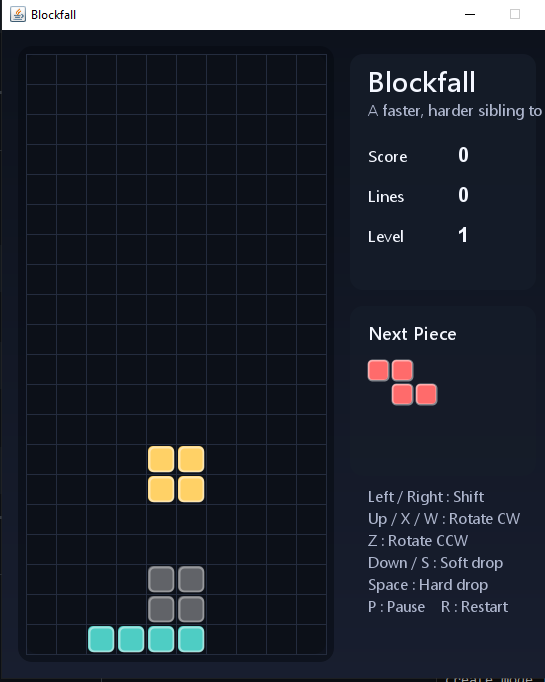

# Java Game Playground — Kavunn Engine

Three playable Java Swing games built on top of a custom-designed entity-command framework (the **Kavunn Engine**), backed by a full rendering pipeline, a 2D physics engine, an asset management system, and cross-platform surface abstractions:

- **Snake** — the classic grid-chase game.
- **Blockfall** — a harder falling-block puzzle inspired by classic line-clearing games, with gravity, rotation, speed scaling, and stack pressure.
- **Ashwake** — a top-down arena-survival roguelite with room progression, six enemy archetypes, projectile combat, modifier upgrades, and a built-in benchmark suite.





---

## Table of Contents

- [Why This Is Interesting](#why-this-is-interesting)
- [Contributing & Collaboration](#contributing--collaboration)
- [Overview](#overview)
- [Architecture](#architecture)
  - [High-Level Structure](#high-level-structure)
  - [Design Patterns](#design-patterns)
  - [How the Shared Core Is Used](#how-the-shared-core-is-used)
- [Core Framework (`core/`)](#core-framework-core)
  - [Relation](#relation)
  - [Association](#association)
  - [ParamValue & PrimaryTypeValue](#paramvalue--primarytypevalue)
  - [Params](#params)
  - [Entity](#entity)
  - [Invoker](#invoker)
  - [EntitiesGraph](#entitiesgraph)
  - [Context](#context)
- [Rendering Pipeline (`render/`)](#rendering-pipeline-render)
  - [Universe](#universe)
  - [Planet](#planet)
  - [Matter](#matter)
  - [RenderingPipeline](#renderingpipeline)
  - [RenderTask & RenderBackend](#rendertask--renderbackend)
  - [SwingRenderingPanel](#swingrenderingpanel)
  - [Backend Implementations](#backend-implementations)
- [Physics Engine (`physics/`)](#physics-engine-physics)
  - [PhysicsScene & PhysicsSpace](#physicsscene--physicsspace)
  - [PhysicsBody & PhysicsMaterial](#physicsbody--physicsmaterial)
  - [Geometry](#geometry)
  - [Collision Detection](#collision-detection)
  - [Forms](#forms)
  - [PhysicsPipeline](#physicspipeline)
  - [Physics Backend](#physics-backend)
  - [Authoring & Importing](#authoring--importing)
- [Asset Manager (`assetmanager/`)](#asset-manager-assetmanager)
- [Platform Abstraction (`platform/`)](#platform-abstraction-platform)
- [Shared Wiring](#shared-wiring)
  - [GameContextFactory](#gamecontextfactory)
  - [Main](#main)
- [Snake Game](#snake-game)
  - [Direction](#direction)
  - [Food](#food)
  - [Snake](#snake)
  - [SnakeWorld](#snakeworld)
  - [DirectionCommand](#directioncommand)
  - [RestartSnakeCommand](#restartsnakecommand)
  - [SnakeGamePanel](#snakegamepanel)
  - [SnakeGameLauncher](#snakegamelauncher)
  - [Snake Mechanics](#snake-mechanics)
- [Blockfall Game](#blockfall-game)
  - [TetrominoType](#tetrominotype)
  - [FallingPiece](#fallingpiece)
  - [TetrisBoard](#tetrisboard)
  - [TetrisWorld](#tetrisworld)
  - [TetrisAction](#tetrisaction)
  - [TetrisActionCommand](#tetrisactioncommand)
  - [TetrisGamePanel](#tetrisgamepanel)
  - [TetrisGameLauncher](#tetrisgamelauncher)
  - [Blockfall Mechanics](#blockfall-mechanics)
- [Ashwake Game](#ashwake-game)
  - [AshwakeRunWorld](#ashwakerunworld)
  - [AshwakePlayer](#ashwakeplayer)
  - [Enemies](#enemies)
  - [Projectiles, Hazards & Pickups](#projectiles-hazards--pickups)
  - [Room Progression](#room-progression)
  - [Modifier System](#modifier-system)
  - [Commands](#commands)
  - [Benchmark Suite](#benchmark-suite)
  - [Ashwake Mechanics](#ashwake-mechanics)
- [Requirements](#requirements)
- [Build](#build)
- [Run](#run)
- [Controls](#controls)
- [Smoke Tests](#smoke-tests)
- [Benchmarks](#benchmarks)
- [Output Directories](#output-directories)
- [Extending the Project](#extending-the-project)

---

## Why This Is Interesting

These are not throwaway game demos. The project is a practical case study in **software architecture** — every moving part in all three games is wired through a hand-built entity-command framework that applies four classic Gang-of-Four design patterns in a single, cohesive system:

- **The entire game loop runs through the Command pattern.** Every tick, the world itself is queued as a `Relation` command and executed by the `Context`. Player inputs (direction changes, rotations, drops, dashes, fire commands) are queued through the exact same pipeline — there is no special-case code for "user actions" vs. "engine ticks".
- **Game objects are a Composite hierarchy.** `SnakeWorld` owns `Snake` and `Food` as child entities. `TetrisWorld` owns `TetrisBoard` and `FallingPiece`. `AshwakeRunWorld` owns `AshwakePlayer` and `AshwakeRoomWorld`, which in turn owns enemies, projectiles, hazards, and pickups. The framework doesn't know what a snake, a tetromino, or a projectile is — it just sees a tree of `Entity` nodes that it can traverse, update, and execute uniformly.
- **Relationships are modeled as a graph.** The `EntitiesGraph` maintains an undirected adjacency list (world ↔ children). Entity relationships are data, not hardcoded method calls — making the system extensible without touching existing classes.
- **Parameters are first-class.** Every entity inherits a typed key-value store (`Params`), so runtime attributes can be attached, queried, and modified without subclassing. Ashwake uses this extensively for render metadata (`layerHint`, `materialKey`, `animationState`, `glowLevel`, etc.).

The result is that all three games contain **zero framework-specific boilerplate**. `SnakeWorld.execute()` just calls `step()`. `TetrisWorld.execute()` just calls `tick()`. `AshwakeRunWorld.execute()` just calls `update(delta)`. The framework handles queuing, execution ordering, history tracking, and entity registration — while the game layers stay clean and focused on game logic.

The proof of this separation is Blockfall (built on `core/` with no framework changes) and Ashwake (built on `core/` + `render/` with no core changes, adding the rendering pipeline and a full roguelite on top). The `core/` package could be lifted out and reused for an entirely different domain — a simulation, an ECS prototype, a turn-based strategy — without changing a line.

Beyond the games, the project includes a multi-backend **rendering pipeline** (Java2D, OpenGL, OpenGL ES, Metal), a 2D **physics engine** with collision detection and rigid-body simulation, an **asset management system** with image-to-mesh preparation, and **cross-platform surface abstractions** for iOS and mobile — all built on the same entity-command foundation.

---

## Contributing & Collaboration

I'm actively looking for **experienced developers, designers, and architects** who want to collaborate on game projects — from small prototypes to production-grade systems.

If you're someone who cares about clean architecture, well-structured codebases, and building things the right way rather than the fast way, I'd like to hear from you. Whether you bring expertise in game engine internals, rendering pipelines, AI/pathfinding, multiplayer networking, or UI/UX design — there's room at the table.

### What I'm looking for

We’re particularly looking for a small number of strong collaborators — especially UI/UX and visual designers alongside strong mid level game developers/system programmers — who care about clean systems, distinctive game feel, and thoughtful product direction.

- **Engineers** with strong fundamentals in OOP, design patterns, and systems thinking.
- **Game developers** experienced with Java, C#, C++, or similar — framework and engine-level work, not just scripting.
- **Game designers** who can craft compelling mechanics, progression systems, and player experiences from the ground up.
- **World designers** with a vision for level layout, environmental storytelling, and spatial flow.
- **Graphic designers** skilled in UI/HUD design, visual identity, iconography, and promotional assets.
- **Technical artists** who understand the intersection of aesthetics and performance.
- **Architects** interested in building reusable frameworks and tools that power multiple projects.

Yet, feel free to reach out even if you don't fit these categories exactly — if you're passionate about game development and want to contribute, I'd love to hear from you.

### What you can expect

- A collaborative, no-ego environment where ideas are evaluated on merit.
- Codebases that prioritize clarity, modularity, and long-term maintainability.
- Serious project scope — this isn't about weekend throwaway demos. We're aiming to build something substantial and lasting.

### Get in touch

If this resonates, reach out directly:

📧 **[suleyman.artun@outlook.com](mailto:suleyman.artun@outlook.com)**

Please include a brief introduction, your area of expertise, and — if available — a link to your work (GitHub, portfolio, or a project you're proud of). Serious inquiries only.

---

## Overview

The codebase started as a small reusable entity-command framework (the Kavunn Engine). It now includes three complete games, a rendering pipeline with multi-backend support, a 2D physics engine, an asset management system, and cross-platform surface abstractions.

| Layer | Package / Location | Purpose |
|---|---|---|
| **Core Framework** | `core/` | A generic, reusable entity-management engine with command queuing, graph-based relationships, composite hierarchies, and typed parameter storage. |
| **Rendering Pipeline** | `render/` | A multi-backend rendering pipeline architecture with Universe → Planet → Matter hierarchy, lifecycle management, and pluggable render tasks. Backends: Java2D, OpenGL (LWJGL), OpenGL ES (Android/iOS), Metal (iOS). |
| **Physics Engine** | `physics/` | A 2D physics simulation framework with rigid bodies, collision detection (narrow-phase + spatial-hash broadphase), geometry primitives, form authoring, raster-shape importing, and a pluggable pipeline mirroring the render architecture. |
| **Asset Manager** | `assetmanager/` | Asset cataloging, manifest loading/validation, image-to-mesh preparation, and OpenGL draft libraries for materials, textures, shaders, palettes, fonts, and UI modules. |
| **Platform** | `platform/` | Cross-platform surface and input abstractions for iOS (Metal + OpenGL ES) and generic mobile (OpenGL ES), including touch event handling and safe-area support. |
| **Snake Game** | Root — `Snake*.java`, `Direction*.java`, `Food.java`, `RestartSnakeCommand.java` | The classic grid-chase game, modeled as entities and commands. |
| **Blockfall Game** | Root — `Tetris*.java`, `FallingPiece.java`, `TetrominoType.java` | A falling-block puzzle game, built on the same core with no framework modifications. |
| **Ashwake Game** | `ashwake/` | A top-down arena-survival roguelite with room progression, modifier upgrades, six enemy archetypes, projectile combat, and a built-in benchmark suite. Uses the `render/` pipeline. |
| **Shared Wiring** | Root — `GameContextFactory.java`, `Main.java` | Entry point and shared context creation for Snake and Blockfall. |

All source files use Java package conventions (`core`, `render`, `physics`, `assetmanager`, `platform.ios`, `platform.mobile`, `ashwake`, or the default package for root files).

---

## Architecture

### High-Level Structure

```
Playground/
├── core/                              # Kavunn Engine — reusable entity-command framework
│   ├── Association.java               # Identity + structural-update interface
│   ├── Context.java                   # Central command bus & entity registry
│   ├── Entity.java                    # Base entity: Params + Association + Relation + Composite
│   ├── EntitiesGraph.java             # Adjacency-list graph of entity relationships
│   ├── Invoker.java                   # Batched command execution (broker pattern)
│   ├── ParamValue.java                # Marker interface for parameter values
│   ├── Params.java                    # Key-value parameter store on every entity
│   ├── PrimaryTypeValue.java          # Type-safe wrapper for int, double, String, boolean, generic
│   └── Relation.java                  # Command interface — void execute()
│
├── render/                            # Rendering pipeline framework
│   ├── Universe.java                  # Top-level render context; mounts a Planet
│   ├── Planet.java                    # Abstract world entity with lifecycle + Matter list
│   ├── Matter.java                    # Render-param container extending EntitiesGraph
│   ├── RenderingPipeline.java         # Abstract pipeline: validate → bind → iterate matters → dispatch tasks
│   ├── DefaultRenderingPipeline.java  # Concrete pipeline with a pluggable task list
│   ├── RenderTask.java               # Functional interface for render operations
│   ├── RenderBackend.java            # Interface for backend drivers
│   ├── SwingRenderingPanel.java       # JPanel adapter for Java2D rendering
│   ├── Java2DRenderBackend.java       # Java2D backend
│   ├── Java2DRenderTask.java          # Java2D-specific render task
│   ├── OpenGLRenderBackend.java       # Desktop OpenGL backend
│   ├── LwjglOpenGLBridge.java         # LWJGL 3.4.1 native bridge
│   ├── OpenGLESRenderBackend.java     # Mobile OpenGL ES backend
│   ├── AndroidOpenGLESBridge.java     # Android OpenGL ES bridge
│   ├── IosOpenGLESBridge.java         # iOS OpenGL ES bridge
│   ├── MetalRenderBackend.java        # Apple Metal backend
│   ├── IosMetalBridge.java            # iOS Metal bridge
│   ├── NoOpRenderBackend.java         # Silent backend for testing
│   └── ...                            # Constants, bridge exceptions, domain entities
│
├── physics/                           # 2D physics engine
│   ├── scene/                         # PhysicsScene, PhysicsSpace, PhysicsMatter
│   ├── body/                          # PhysicsBody, PhysicsMaterial, MotionState
│   ├── geometry/                      # Vector2, Transform2, Bounds2, Circle2, Quad2, Triangle2, Mesh2, Contour2, Triangulator2
│   ├── form/                          # Form2 interface, CircleForm, QuadForm, TriangleForm, MeshForm, CompositeForm
│   ├── collision/                     # CollisionDetector2, CollisionReport, ContactManifold, Raycast/Overlap/Sweep commands
│   ├── pipeline/                      # PhysicsPipeline, DefaultPhysicsPipeline, PhysicsTask
│   ├── backend/                       # DeterministicPhysicsBackend, SpatialHashBroadphase, NoOp
│   ├── authoring/                     # AnchorPoint, FormComposer, FormMorpher
│   ├── importing/                     # ContourTracer, RasterShapeExtractor — bitmap-to-physics-form conversion
│   └── palette/                       # PhysicsColor, PaletteExtractor, PaletteSet, PaletteSwatch
│
├── assetmanager/                      # Asset management system
│   ├── AssetManager.java              # Central manager for entity bundles and draft libraries
│   ├── AssetManagerSmokeTest.java     # Comprehensive smoke test
│   ├── catalog/                       # AssetCatalog, AssetKey, EntityAssetBundle
│   ├── font/                          # FontStyle
│   ├── manifest/                      # Manifest loading, importing, validation, authoring adapter
│   ├── mesh/                          # Image → mesh pipeline (EntityMeshSequence, ImageMeshBuilder)
│   ├── opengl/                        # OpenGL draft library: materials, textures, shaders, palettes, fonts, UI
│   ├── pipeline/                      # AssetPreparationPipeline, reports, tasks
│   ├── source/                        # Image asset sources (BufferedImage, Path, EntityImageSequence)
│   └── ui/                            # UiElementType
│
├── platform/                          # Cross-platform surface abstractions
│   ├── ios/                           # iOS: Metal + OpenGL ES surfaces, touch input, safe area
│   │   └── nativebridge/              # iOS native Metal bridge
│   └── mobile/                        # Generic mobile: OpenGL ES surface, touch events
│
├── ashwake/                           # Ashwake — arena-survival roguelite
│   ├── AshwakeLauncher.java           # Entry point: launch, smoke test, benchmark
│   ├── AshwakeContextFactory.java     # Context + entity graph wiring
│   ├── AshwakeRunWorld.java           # Top-level run entity — room progression, combat, scoring
│   ├── AshwakePlayer.java             # Player entity — health, ward, energy, dash, fire
│   ├── AshwakeRoomWorld.java          # Room container — enemies, projectiles, hazards, pickups
│   ├── AshwakeEnemy.java              # 6 enemy archetypes with distinct AI
│   ├── AshwakeProjectile.java         # 5 projectile kinds with pierce/lifetime
│   ├── AshwakeHazard.java             # Area-of-effect zones (friendly and hostile)
│   ├── AshwakePickup.java             # 3 pickup types: health, ember, energy
│   ├── AshwakeModifier.java           # 8 run modifiers (roguelite upgrades)
│   ├── AshwakeRoomKind.java           # 5 room types: Combat, Reward, Event, Elite, Boss
│   ├── AshwakeCommands.java           # 8 command classes (move, fire, dash, pause, etc.)
│   ├── AshwakeGamePanel.java          # SwingRenderingPanel subclass with input handling
│   ├── AshwakeRenderFactory.java      # Java2D rendering pipeline + visual styling
│   ├── AshwakeBenchmark.java          # Performance benchmark suite (warmup + measured frames)
│   └── AshwakeBenchmarkScenario.java  # 3 benchmark scenarios
│
├── GameContextFactory.java            # Shared: creates Context + registers world & children
├── Main.java                          # Entry point: --smoke-test, snake, blockfall
│
├── Direction.java … SnakeWorld.java   # Snake game (8 files)
├── TetrominoType.java … TetrisWorld.java  # Blockfall game (8 files)
│
├── lib/lwjgl/3.4.1/                   # LWJGL native OpenGL bindings
├── docs/                              # Screenshots and documentation assets
├── out/                               # Compiled output (Snake + Blockfall)
├── out_ashwake/                        # Compiled output (Ashwake)
├── out_verify/                         # Verification build output
├── LICENSE                             # Kavunn Engine Source-Available License
└── README.md                           # This file
```

### Design Patterns

The project applies four classic GoF patterns, all wired through the core framework:

| Pattern | Where | How |
|---|---|---|
| **Command** | `Relation` interface, `DirectionCommand`, `RestartSnakeCommand`, `TetrisActionCommand`, `SnakeWorld.execute()`, `TetrisWorld.execute()` | Every user action and every game tick is encoded as a `Relation` object, queued via `Context.queueCommand()`, and executed in batch via `Context.executeQueuedCommands()`. |
| **Composite** | `Entity.children` | Entities can contain child entities (e.g. `SnakeWorld` holds `Snake` + `Food`; `TetrisWorld` holds `TetrisBoard` + `FallingPiece`), enabling recursive operations across the hierarchy. |
| **Mediator / Graph** | `EntitiesGraph` | An undirected adjacency-list graph tracks which entities are related. `GameContextFactory` registers world ↔ child edges automatically. |
| **Invoker / Broker** | `Invoker` | `EntitiesGraph` extends `Invoker` to maintain a broker list of `Relation` objects. When relations (edges) are added to the graph, the corresponding entities are also registered as brokers for potential batch execution. |

### How the Shared Core Is Used

All three games follow the identical pattern:

1. A world class extends `Entity<Relation>` (`SnakeWorld` / `TetrisWorld`) or `Planet` (`AshwakeRunWorld`).
2. Child entities are attached to that world via `addChildEntity()`.
3. A context factory (`GameContextFactory.create()` or `AshwakeContextFactory.create()`) builds a `Context`, registers the world + all children in the entity list and graph, and adds world ↔ child edges.
4. Player actions are wrapped as `Relation` commands and queued through the context.
5. Each timer tick queues the world itself as a command, which runs the next step of game logic through `execute()`.

The game loop and the player input system are both routed through the same command pipeline — neither bypasses the framework.

---

## Core Framework (`core/`)

The Kavunn Engine is fully generic — it knows nothing about snakes, tetrominoes, or games. Any domain can reuse it.

### Relation

```java
public interface Relation {
    void execute();
}
```

The **Command** abstraction. Every executable behavior — whether it is a game tick, a direction change, a block rotation, or a restart — implements this single-method interface. `Relation` objects are what get queued, executed, and tracked in command history.

### Association

```java
public interface Association {
    String getLabel();
    void setLabel(String label);
    int getId();
    void setId(int id);
    void update();
}
```

Provides **identity** (`id` + `label`) and a **structural update hook** (`update()`). Both `Entity` and `EntitiesGraph` implement this interface, meaning individual entities and entire graphs share a common identity/update contract.

- `getLabel()` / `setLabel()` — human-readable name.
- `getId()` / `setId()` — integer identifier.
- `update()` — hook for the Composite pattern; subclasses override this to propagate state changes down an entity tree.

### ParamValue & PrimaryTypeValue

```java
public interface ParamValue { }
```

```java
public class PrimaryTypeValue<T> implements ParamValue {
    // Wraps int, double, String, boolean, or any generic T
}
```

A type-safe value container system. `ParamValue` is a marker interface. `PrimaryTypeValue<T>` provides factory methods:

| Factory Method | Wrapped Type |
|---|---|
| `PrimaryTypeValue.integer(int)` | `Integer` |
| `PrimaryTypeValue.doubleVal(double)` | `Double` |
| `PrimaryTypeValue.string(String)` | `String` |
| `PrimaryTypeValue.bool(boolean)` | `Boolean` |
| `PrimaryTypeValue.of(T)` | Any `T` |

These are stored inside `Params` objects attached to every `Entity`.

### Params

```java
public class Params {
    private Map<String, ParamValue> kwargs;
    // constructor, add(), get(), static of() factories
}
```

A **key-value attribute store** backed by a `HashMap<String, ParamValue>`. Every `Entity` extends `Params` (inheriting its map), so any entity can carry arbitrary named parameters at runtime.

Static convenience factories: `Params.of("key", 42)`, `Params.of("key", 3.14)`, `Params.of("key", "text")`, `Params.of("key", true)`.

### Entity

```java
public class Entity<T extends Relation> extends Params implements Association, Relation
```

The central abstraction. Every game-world object (`SnakeWorld`, `Snake`, `Food`, `TetrisWorld`, `TetrisBoard`, `FallingPiece`) extends `Entity`. It unifies:

| Concern | Source |
|---|---|
| **Attributes** | `Params` (inherited) — key-value parameter map |
| **Identity** | `Association` (implemented) — `id` and `label` |
| **Behavior** | `Relation` (implemented) — `execute()` |
| **Hierarchy** | `children: List<T>` — Composite pattern for nested entities |

Key methods:

- `addChildEntity(T)` / `removeChildEntity(T)` / `getChildren()` — manage composite children.
- `execute()` — default no-op; subclasses override to define per-tick behavior (e.g. `SnakeWorld.execute()` calls `step()`, `TetrisWorld.execute()` calls `tick()`).
- `update()` — default no-op; subclasses override for structural propagation.
- `equals()` / `hashCode()` — identity based on `(id, label)`, enabling graph lookups via temporary proxy entities.
- `toString()` — debug representation: `Entity{id=100, label='snake-world'}`.

The constructor calls `super(label, PrimaryTypeValue.integer(id))`, storing the entity's id as its very first parameter in the inherited `Params` map.

### Invoker

```java
public class Invoker {
    private List<Relation> relationList;
    void addBroker(Relation);
    void executeBroker();
    void removeBroker(Relation);
}
```

A **batch command executor** (broker pattern). Maintains a list of `Relation` objects and can execute them all in sequence via `executeBroker()`. Used as the base class for `EntitiesGraph`.

### EntitiesGraph

```java
public class EntitiesGraph extends Invoker implements Association
```

An **undirected adjacency-list graph** of entities. Each node is an `Entity` and edges represent relationships between entities.

Key methods:

| Method | Description |
|---|---|
| `addEntity(id, label)` | Insert a node into the graph. |
| `removeEntity(id, label)` | Remove a node and all edges pointing to it. |
| `addRelation(id1, label1, id2, label2)` | Create a bidirectional edge between two entities. Also registers both entities as brokers in the inherited `Invoker`. |
| `removeRelation(id1, label1, id2, label2)` | Remove a bidirectional edge and deregister brokers. |
| `getAdjacentVertices(id, label)` | Return all neighbors of a given entity. |
| `update()` | Iterate over every registered entity and call `entity.update()` (Composite propagation across the whole graph). |

The graph also implements `Association`, so it has its own `group_id` and `group_label` — allowing graphs themselves to be nested or referenced as identifiable objects.

### Context

```java
public class Context {
    private Relation state;
    private List<Relation> entities;
    private EntitiesGraph graph;
    private Deque<Relation> commandQueue;
    private Deque<Relation> commandHistory;
}
```

The **central mediator** and command bus. It ties everything together:

| Field | Purpose |
|---|---|
| `state` | The "current" active relation (optional state reference). |
| `entities` | A flat list of all registered `Relation` objects (entities). |
| `graph` | The `EntitiesGraph` tracking entity relationships. |
| `commandQueue` | FIFO queue of commands waiting to be executed. |
| `commandHistory` | Stack of executed commands (supports potential undo functionality). |

Command lifecycle:

1. **Queue**: `context.queueCommand(command)` → pushes onto `commandQueue`.
2. **Execute**: `context.executeQueuedCommands()` → drains the queue, executing each command and pushing it onto `commandHistory`.
3. **Immediate**: `context.executeCommand(command)` → executes immediately and records to history.
4. **State-based**: `context.action()` → executes `state.execute()`.

---

## Rendering Pipeline (`render/`)

The rendering pipeline provides a structured, multi-backend architecture for drawing game worlds. It mirrors the core framework's entity model and introduces three domain abstractions — **Universe**, **Planet**, and **Matter** — that organize render state hierarchically.

### Universe

```java
public class Universe extends Matter
```

The top-level rendering context. A `Universe` holds a `Context` (the rendering context, separate from the game context) and an active `Planet`. When a planet is mounted via `mountPlanet(planet)`, it is registered in the rendering context's entity list and set as the current state.

### Planet

```java
public abstract class Planet extends Entity<Relation>
```

An abstract world entity with a managed lifecycle and a list of `Matter` objects. Every game world that participates in the render pipeline extends `Planet` (e.g. `AshwakeRunWorld`).

**Lifecycle states**: `CREATED → RUNNING → PAUSED → CLOSED → EXITED`

| Method | Description |
|---|---|
| `startPlanet()` | Transition to `RUNNING`. |
| `pausePlanet()` / `resumePlanet()` | Toggle pause. |
| `closePlanet()` / `restartPlanet()` | Close or restart. |
| `exitPlanet()` | Terminal state — cannot be restarted. |
| `canExecutePlanet()` | Returns `true` only when `RUNNING`. Subclasses check this in `execute()`. |
| `addMatter()` / `getMatters()` | Register render layers. |

### Matter

```java
public class Matter extends EntitiesGraph implements Iterable<Map.Entry<String, Params>>
```

A render-parameter container that extends `EntitiesGraph`. Each `Matter` holds a `LinkedHashMap<String, Params>` of named render parameters (layer hint, material key, sort bias, etc.). Matters are iterated by the pipeline in registration order and represent logical render layers (backdrop, arena, actors, projectiles, HUD, etc.).

### RenderingPipeline

```java
public abstract class RenderingPipeline
```

The abstract rendering pipeline. The `render(Universe, Planet, RenderBackend)` method drives the following sequence:

1. **Validate** — null checks.
2. **Prepare lifecycle** — auto-start created/closed planets.
3. **Bind** — mount the planet in the universe.
4. **Begin frame** — `backend.beginFrame()`.
5. **For each Matter** — `beforeMatter()` → execute matching `RenderTask` objects → `afterMatter()`.
6. **End frame** — `backend.endFrame()`.

`DefaultRenderingPipeline` extends this with a pluggable list of `RenderTask` objects.

### RenderTask & RenderBackend

```java
@FunctionalInterface
public interface RenderTask {
    void execute(RenderBackend backend, Universe universe, Planet planet, Matter matter);
}
```

```java
public interface RenderBackend {
    String getBackendName();
    // beginFrame, beforeMatter, afterMatter, endFrame
}
```

Tasks are the unit of rendering work. Each task can query `supports(backend)` to skip incompatible backends. The backend interface abstracts the underlying graphics API.

### SwingRenderingPanel

```java
public class SwingRenderingPanel extends JPanel
```

A `JPanel` adapter that bridges the pipeline into Java2D. On every `paintComponent()` call, it creates a `Java2DRenderBackend`, invokes the pipeline, and disposes the graphics context. Subclasses override `beforePipelineRender()` / `afterPipelineRender()` for custom setup.

### Backend Implementations

| Backend | Class | Platform |
|---|---|---|
| **Java2D** | `Java2DRenderBackend` | Desktop (Swing) |
| **OpenGL** | `OpenGLRenderBackend` + `LwjglOpenGLBridge` | Desktop (LWJGL 3.4.1) |
| **OpenGL ES** | `OpenGLESRenderBackend` + `AndroidOpenGLESBridge` / `IosOpenGLESBridge` | Android / iOS |
| **Metal** | `MetalRenderBackend` + `IosMetalBridge` | iOS |
| **No-op** | `NoOpRenderBackend` | Testing / benchmarks |

---

## Physics Engine (`physics/`)

A 2D physics simulation framework with 10 sub-packages. It follows the same pipeline architecture as the render system but operates on physical bodies instead of visual matters.

### PhysicsScene & PhysicsSpace

`PhysicsScene` mirrors `Planet` — an abstract entity with the same lifecycle states (`CREATED → RUNNING → PAUSED → CLOSED → EXITED`), a list of `PhysicsMatter` groups, and a configurable gravity vector (`Vector2`, default `(0, 9.81)`).

`PhysicsSpace` mirrors `Universe` — it mounts a `PhysicsScene` and provides the top-level simulation context.

### PhysicsBody & PhysicsMaterial

```java
public class PhysicsBody extends Entity<Relation>
```

A rigid body with position, rotation, velocity, mass, collision layers, and a `Form2` shape. Key features:

- **MotionState**: transform + linear velocity + force accumulator.
- **Dynamic vs. static**: setting mass to 0 makes the body static.
- **Sensor mode**: detects overlaps without physical response.
- **Collision filtering**: bitwise layer/mask system.
- **Cached geometry**: world-space mesh, contour, and bounds are lazily computed and invalidated on transform changes.

`PhysicsMaterial` holds `friction` and `restitution` (bounce) coefficients.

### Geometry

`physics.geometry` provides the 2D math primitives:

| Class | Description |
|---|---|
| `Vector2` | Immutable 2D vector with add, subtract, multiply, dot, cross, normalize, distance, lerp. |
| `Transform2` | Position + rotation + scale; `apply(Vector2)` transforms points. |
| `Bounds2` | Axis-aligned bounding box with overlap/containment tests. |
| `Circle2` | Center + radius. |
| `Quad2` | Four-vertex quadrilateral. |
| `Triangle2` | Three-vertex triangle. |
| `Mesh2` | Triangle-soup mesh (list of `Triangle2`). |
| `Contour2` | Ordered point loop for collision shapes. |
| `Triangulator2` | Ear-clipping triangulation for contours → meshes. |
| `Geometry2` | Static utilities (line intersection, point-in-triangle, etc.). |

### Collision Detection

`physics.collision` provides narrow-phase and query APIs:

| Class | Description |
|---|---|
| `CollisionDetector2` | Full narrow-phase: circle–circle, circle–polygon, polygon–polygon (SAT), mesh–mesh. |
| `CollisionReport` | Result: hit flag, contact manifold, penetration depth, normal. |
| `ContactManifold` / `ContactPoint` | Contact geometry for resolution. |
| `OverlapCommand` | Boolean overlap query between two bodies. |
| `RaycastCommand` / `RaycastHit` | Ray-vs-body intersection with hit point, normal, distance. |
| `SweepCommand` | Swept-body collision test. |

### Forms

`physics.form` provides shape definitions consumed by both collision and rendering:

| Form | Description |
|---|---|
| `CircleForm` | Circle shape. |
| `QuadForm` | Quad shape. |
| `TriangleForm` | Triangle shape. |
| `MeshForm` | Arbitrary triangle-mesh shape. |
| `CompositeForm` | Union of multiple sub-forms. |

All forms implement `Form2`, which provides `toWorldMesh()`, `toWorldContour()`, and `getLocalBounds()`.

### PhysicsPipeline

```java
public abstract class PhysicsPipeline
```

Mirrors `RenderingPipeline` structure. The `simulate(PhysicsSpace, PhysicsScene, deltaSeconds, PhysicsBackend)` method drives:

1. Validate → prepare lifecycle → bind.
2. **For each PhysicsMatter** → **for each PhysicsBody** → execute `PhysicsTask` objects.
3. `backend.step()` → after-simulation hooks.

### Physics Backend

| Backend | Description |
|---|---|
| `DeterministicPhysicsBackend` | Full simulation: integration, broadphase, narrowphase, resolution. |
| `SpatialHashBroadphase` | Grid-based spatial hashing for efficient pair generation. |
| `NoOpPhysicsBackend` | Silent backend for testing. |

### Authoring & Importing

- **`FormComposer`** — programmatic shape composition (merge, offset, scale forms).
- **`FormMorpher`** — interpolate between two forms over time.
- **`AnchorPoint`** — named attachment points on forms.
- **`ContourTracer`** — trace contours from binary raster images (marching-squares).
- **`RasterShapeExtractor`** — full bitmap → physics-form pipeline with configurable options and profiles.
- **`PaletteExtractor`** — extract dominant color palettes from images.

---

## Asset Manager (`assetmanager/`)

A comprehensive asset cataloging and preparation system. The `AssetManager` entry point manages two catalogs:

- **Entity bundles** (`EntityAssetBundle`) — image sequences, mesh data, and prepared GPU-ready assets keyed by `AssetKey`.
- **Draft libraries** (`OpenGLDraftLibrary`) — OpenGL material, texture, shader, palette, font, and UI module drafts.

Key sub-packages:

| Package | Purpose |
|---|---|
| `catalog/` | `AssetCatalog<T>` — generic keyed registry. `AssetKey` — composite key. `EntityAssetBundle` — bundle of image frames + prepared meshes. |
| `manifest/` | `AssetManifestLoader` — load manifests from disk. `AssetManifestImporter` — import external assets. `AssetManifestValidator` — validate manifest integrity. `AssetAuthoringManifestAdapter` — bridge manifests to the authoring pipeline. |
| `mesh/` | `ImageMeshBuilder` — convert images to triangle meshes via contour tracing. `EntityMeshSequence` — ordered mesh frames for animation. |
| `pipeline/` | `AssetPreparationPipeline` / `DefaultAssetPreparationPipeline` — run preparation tasks and produce `AssetPreparationReport` results. |
| `source/` | `ImageAssetSource` — abstraction for image loading. Implementations: `BufferedImageAssetSource`, `PathImageAssetSource`. `EntityImageSequence` — ordered image frames. |
| `opengl/` | Draft descriptors for OpenGL resources: materials, textures, shaders, palettes, fonts, UI elements, and UI modules. |

---

## Platform Abstraction (`platform/`)

Cross-platform surface and input abstractions for mobile deployment.

### iOS (`platform/ios/`)

| Class | Purpose |
|---|---|
| `IosSurface` | Interface: surface lifecycle + `renderFrame()`. |
| `IosMetalSurface` | Metal-backed surface with CAMetalLayer integration. |
| `IosOpenGLESSurface` | OpenGL ES-backed surface with EAGLContext. |
| `IosInputAdapter` | Touch event → game command adapter. |
| `IosTouchEvent` / `IosTouchPhase` | Touch data model. |
| `IosSafeAreaInsets` | Safe area insets for notched devices. |
| `IosInterfaceOrientation` | Portrait/landscape/flat orientation. |
| `IosMetalNativeBridge` | JNI-style bridge for Metal commands. |

### Mobile (`platform/mobile/`)

| Class | Purpose |
|---|---|
| `MobileSurface` | Generic mobile surface interface. |
| `MobileOpenGLESSurface` | OpenGL ES surface with context management. |
| `MobileInputAdapter` | Touch event adapter. |
| `MobileTouchEvent` / `MobileTouchAction` | Touch data model (DOWN, MOVE, UP, CANCEL). |

---

## Shared Wiring

### GameContextFactory

```java
public final class GameContextFactory {
    public static Context create(Entity<? extends Relation> world)
}
```

A static factory that replaces the per-game wiring that previously lived inside each launcher. It:

1. Creates a new `Context`.
2. Registers the world entity in the context's entity list and graph.
3. Iterates over `world.getChildren()` — for each child that is an `Entity`, it registers it in the entity list, adds it to the graph, and creates a bidirectional edge (`world ↔ child`). Non-entity children are added to the entity list only.

Both `SnakeGameLauncher` and `TetrisGameLauncher` call `GameContextFactory.create(world)` instead of duplicating this logic.

### Main

```java
public class Main
```

Unified entry point for both games:

| Command | Action |
|---|---|
| `java -cp out Main` | Launch Blockfall (default). |
| `java -cp out Main blockfall` | Launch Blockfall explicitly. |
| `java -cp out Main snake` | Launch Snake. |
| `java -cp out Main --smoke-test` | Run both smoke tests. |
| `java -cp out Main --smoke-test snake` | Run Snake smoke test only. |
| `java -cp out Main --smoke-test tetris` | Run Blockfall smoke test only. |

The `isBlockfall()` helper accepts both `"tetris"` and `"blockfall"` as aliases.

---

## Snake Game

These classes implement the Snake game using the core framework.

### Direction

```java
public enum Direction {
    UP(0, -1), DOWN(0, 1), LEFT(-1, 0), RIGHT(1, 0);
}
```

Each constant carries a movement vector (`dx`, `dy`). The `isOpposite(Direction)` method checks whether two directions cancel out (e.g. UP ↔ DOWN), which prevents the snake from reversing into itself.

### Food

```java
public class Food extends Entity<Relation>
```

Entity ID: **102**. Stores a single `Point position`. The `relocate(Point)` method repositions the food after the snake eats it. Defensively copies points to prevent mutation.

### Snake

```java
public class Snake extends Entity<Relation>
```

Entity ID: **101**. Manages the snake's body and movement:

| Field | Description |
|---|---|
| `body: Deque<Point>` | Ordered segments — head at front, tail at back. Initialized with 3 segments at the center of the board, extending leftward. |
| `direction` | The currently committed direction of travel. |
| `pendingDirection` | The direction the player has queued; committed on the next `advance()`. |

Key methods:

| Method | Description |
|---|---|
| `reset(x, y)` | Clear the body and place 3 segments at `(x, y)`, `(x-1, y)`, `(x-2, y)`. Reset direction to `RIGHT`. |
| `queueDirection(dir)` | Accept a new direction unless it is `null` or the exact opposite of the current direction. |
| `nextHead()` | Compute the next head position by adding `pendingDirection`'s delta to the current head. |
| `advance(nextHead, grow)` | Commit the `pendingDirection`, push a new head segment. If not growing (no food eaten), remove the tail. |
| `hitsSelf(candidate, growing)` | Check if `candidate` collides with any body segment. When not growing, the about-to-be-removed tail segment is excluded from the collision check. |
| `occupies(point)` | Check if any body segment occupies a given point (used for food spawning). |
| `getSegments()` | Return a defensive copy of the body as a `List<Point>`. |

### SnakeWorld

```java
public class SnakeWorld extends Entity<Relation>
```

Entity ID: **100**. The top-level game entity. Contains the `Snake` and `Food` as composite children.

| Field | Description |
|---|---|
| `width`, `height` | Board dimensions (default 20 × 20 in the GUI, 12 × 12 in the smoke test). |
| `random` | `Random` instance for food placement. Accepts a seeded `Random` for deterministic testing. |
| `snake`, `food` | Child entities. |
| `score` | Number of food items consumed. |
| `gameOver` | Set to `true` when the snake collides with a wall or itself. |
| `victory` | Set to `true` when the snake fills the entire board. |

Key methods:

| Method | Description |
|---|---|
| `execute()` | Overrides `Entity.execute()` — calls `step()`. The world itself is queued as a command each tick. |
| `step()` | Core game logic: compute next head, check wall/self collisions, advance snake, handle eating, and spawn new food. |
| `restart()` | Reset score, flags, snake position, and re-spawn food. |
| `spawnFood()` | Randomly place food on a tile not occupied by the snake. If the snake fills the entire board, trigger victory. |

### DirectionCommand

```java
public class DirectionCommand implements Relation
```

A command that calls `snake.queueDirection(direction)`. Queued via `Context` whenever the player presses a movement key. Does not directly move the snake — the direction is applied on the next `SnakeWorld.step()`.

### RestartSnakeCommand

```java
public class RestartSnakeCommand implements Relation
```

A command that calls `world.restart()`. Queued via `Context` when the player presses `R`.

### SnakeGamePanel

```java
public class SnakeGamePanel extends JPanel implements ActionListener, KeyListener
```

The Swing rendering and input component:

**Constants:**

| Constant | Value | Purpose |
|---|---|---|
| `CELL_SIZE` | 28 px | Pixel size of each grid cell. |
| `HUD_HEIGHT` | 88 px | Vertical space for the heads-up display. |
| `TICK_MS` | 120 ms | Timer interval between game ticks (~8.3 FPS). |

**Color Palette:**

| Name | RGB | Used For |
|---|---|---|
| `SURFACE_TOP` | `(14, 27, 31)` | Background gradient — top |
| `SURFACE_BOTTOM` | `(22, 46, 42)` | Background gradient — bottom |
| `BOARD_DARK` | `(24, 54, 48)` | Checkerboard dark cells |
| `BOARD_LIGHT` | `(30, 66, 58)` | Checkerboard light cells |
| `SNAKE_HEAD` | `(242, 197, 70)` | Golden head segment |
| `SNAKE_BODY` | `(106, 201, 145)` | Green body segments |
| `FOOD` | `(235, 94, 72)` | Red food circle |
| `HUD_TEXT` | `(240, 245, 237)` | Primary HUD text |
| `HUD_MUTED` | `(186, 199, 190)` | Secondary HUD text |

**Rendering Pipeline** (`paintComponent` → `Graphics2D`):

1. `paintBackground()` — Full-panel vertical gradient.
2. `paintHud()` — Rounded semi-transparent card with title, controls hint, score, and snake length.
3. `paintBoard()` — Checkerboard grid with rounded cells.
4. `paintFood()` — Red circle with a small highlight for a 3D effect.
5. `paintSnake()` — Rounded rectangles drawn back-to-front; head is golden, body is green.
6. `paintOverlay()` — Game-over overlay with "Game Over" or "Board Cleared" plus a restart hint.

Anti-aliasing is enabled for both shape and text rendering.

### SnakeGameLauncher

```java
public final class SnakeGameLauncher
```

A static utility class that wires the Snake game:

- **`launch()`**: Creates `SnakeWorld(20, 20)`, builds a `Context` via `GameContextFactory.create()`, wraps `SnakeGamePanel` in a `JFrame`.
- **`runSmokeTest()`**: Creates a 12 × 12 world with `Random(7L)`, queues a DOWN direction + 5 ticks, and returns a diagnostic string.

### Snake Mechanics

- **Board**: 20 × 20 grid (400 tiles), rendered as 28 × 28 px rounded cells in a checkerboard.
- **Movement**: One cell per tick (120 ms). Direction changes are queued — only one change per tick, preventing 180° reversals.
- **Collision**: Wall collision (leaving the grid) and self collision (hitting own body, excluding the tail when not growing) both end the game.
- **Scoring**: Each food item increments score by 1 and grows the snake by 1 segment. Food respawns on a random free tile.
- **Victory**: Filling every tile on the board ("Board Cleared").

**Game loop:**

```
Timer (120ms) → queue world → executeQueuedCommands → world.step() → repaint
Key press → queue DirectionCommand/RestartSnakeCommand → executeQueuedCommands → repaint
```

---

## Blockfall Game

These classes implement the Blockfall (falling-block puzzle) game using the same core framework.

### TetrominoType

```java
public enum TetrominoType { I, O, T, S, Z, J, L }
```

Defines all 7 standard tetromino shapes. Each constant stores:

- A `Color` for rendering.
- A `int[4][4][2]` array of 4 rotation states, where each rotation is 4 cells specified as `[row, col]` offsets.

| Piece | Color | RGB |
|---|---|---|
| `I` | Cyan | `(78, 205, 196)` |
| `O` | Yellow | `(255, 209, 102)` |
| `T` | Purple | `(199, 125, 255)` |
| `S` | Green | `(120, 220, 82)` |
| `Z` | Red | `(255, 107, 107)` |
| `J` | Blue | `(94, 114, 228)` |
| `L` | Orange | `(255, 159, 67)` |

The `cells(int rotation)` method returns the cell layout for a given rotation, wrapping via `Math.floorMod`.

### FallingPiece

```java
public class FallingPiece extends Entity<Relation>
```

Entity ID: **202**. Represents the currently active falling piece:

| Field | Description |
|---|---|
| `type` | The `TetrominoType` of this piece. |
| `row`, `col` | Current grid position (top-left origin). |
| `rotation` | Current rotation state (0–3). |

Key methods:

| Method | Description |
|---|---|
| `reset(type, row, col)` | Set piece type, position, and reset rotation to 0. |
| `moveBy(dx, dy)` | Shift position by delta. |
| `moveTo(row, col)` | Set absolute position. |
| `setRotation(int)` | Set rotation, wrapped to `[0, 3]` via `floorMod`. |
| `cells()` | Return the 4 cell positions for the current state. |
| `cellsFor(row, col, rotation)` | Return cell positions for a hypothetical state (used for collision checking before committing). |

### TetrisBoard

```java
public class TetrisBoard extends Entity<Relation>
```

Entity ID: **201**. The locked-cell grid:

| Field | Description |
|---|---|
| `rows`, `cols` | Board dimensions (20 rows × 10 columns). |
| `lockedCells: TetrominoType[][]` | 2D array — `null` means empty, non-null means a locked block of that type (used for per-type coloring). |

Key methods:

| Method | Description |
|---|---|
| `clear()` | Fill all cells with `null`. |
| `canPlace(piece)` / `canPlace(piece, row, col, rotation)` | Check if a piece fits at a position without colliding with walls or locked cells. |
| `lock(piece)` | Copy the piece's cells into the locked grid. |
| `clearFullLines()` | Remove completed rows, compact the grid downward, return the number of lines cleared. |
| `getCell(row, col)` | Return the `TetrominoType` at a position (or `null`). |

### TetrisWorld

```java
public class TetrisWorld extends Entity<Relation>
```

Entity ID: **200**. The top-level Blockfall entity. Contains `TetrisBoard` and `FallingPiece` as composite children.

| Field | Description |
|---|---|
| `board`, `activePiece` | Child entities. |
| `bag: List<TetrominoType>` | The 7-bag randomizer — shuffles all 7 types, draws until empty, then reshuffles. |
| `nextType` | The next piece to spawn (shown in the sidebar preview). |
| `score` | Accumulated score. |
| `linesCleared` | Total lines cleared. |
| `level` | Current level: `1 + (linesCleared / 10)`. |
| `paused`, `gameOver` | State flags. |

Key methods:

| Method | Description |
|---|---|
| `execute()` | Overrides `Entity.execute()` — calls `tick()`. |
| `tick()` | Gravity: try to move the piece down by 1. If it can't, lock it. |
| `moveHorizontal(dx)` | Shift the piece left or right (±1). |
| `softDrop()` | Move down 1 row, scoring +1 per row. If blocked, lock. |
| `hardDrop()` | Drop to the lowest valid row instantly, scoring +2 per row. Then lock. |
| `rotateClockwise()` / `rotateCounterClockwise()` | Rotate with a 6-position wall-kick table: `{0,0}, {+1,0}, {-1,0}, {+2,0}, {-2,0}, {0,-1}`. |
| `togglePause()` | Toggle pause state. |
| `restart()` | Clear board, reset bag, score, lines, level, spawn first piece. |
| `lockPiece()` | Lock the piece into the board, clear full lines, update scoring, spawn next piece. |
| `spawnPiece()` | Draw from bag, reset active piece to spawn position. If the piece can't be placed, set `gameOver`. |
| `getGhostCells()` | Compute where the piece would land if hard-dropped (for the ghost preview). |
| `getTickDelay()` | Dynamic tick speed: `max(120, 620 - (level - 1) × 45)` ms. Starts at 620 ms, speeds up by 45 ms per level, bottoms out at 120 ms. |

**Scoring:**

| Lines Cleared | Points |
|---|---|
| 1 | `100 × level` |
| 2 | `300 × level` |
| 3 | `500 × level` |
| 4+ | `800 × level` |

Soft drop: +1 per row. Hard drop: +2 per row.

### TetrisAction

```java
public enum TetrisAction {
    MOVE_LEFT, MOVE_RIGHT, ROTATE_CW, ROTATE_CCW,
    SOFT_DROP, HARD_DROP, TOGGLE_PAUSE, RESTART
}
```

Enumerates all player actions for Blockfall.

### TetrisActionCommand

```java
public class TetrisActionCommand implements Relation
```

A command that dispatches a `TetrisAction` to the world via an enhanced `switch` expression:

```java
case MOVE_LEFT  → world.moveHorizontal(-1);
case MOVE_RIGHT → world.moveHorizontal(1);
case ROTATE_CW  → world.rotateClockwise();
case ROTATE_CCW → world.rotateCounterClockwise();
case SOFT_DROP  → world.softDrop();
case HARD_DROP  → world.hardDrop();
case TOGGLE_PAUSE → world.togglePause();
case RESTART    → world.restart();
```

### TetrisGamePanel

```java
public class TetrisGamePanel extends JPanel implements ActionListener, KeyListener
```

The Swing rendering and input component for Blockfall:

**Constants:**

| Constant | Value | Purpose |
|---|---|---|
| `CELL_SIZE` | 30 px | Pixel size of each grid cell. |
| `PADDING` | 24 px | Outer padding for the board. |
| `SIDEBAR_WIDTH` | 210 px | Width of the right-side info panel. |

**Color Palette:**

| Name | RGB | Used For |
|---|---|---|
| `BG_TOP` | `(13, 18, 28)` | Background gradient — top |
| `BG_BOTTOM` | `(24, 30, 47)` | Background gradient — bottom |
| `BOARD_BG` | `(12, 16, 24)` | Board surface |
| `GRID` | `(36, 44, 62)` | Grid lines |
| `CARD` | `(22, 28, 41, 220)` | Sidebar card background |
| `TEXT` | `(244, 247, 255)` | Primary text |
| `MUTED` | `(173, 181, 204)` | Secondary text |
| `GHOST` | `(255, 255, 255, 48)` | Ghost piece preview |

**Rendering Pipeline** (`paintComponent` → `Graphics2D`):

1. `paintBackground()` — Full-panel vertical gradient.
2. `paintBoardSurface()` — Rounded board area with grid lines.
3. `paintLockedBlocks()` — Locked cells, colored by `TetrominoType`.
4. `paintGhostPiece()` — Semi-transparent preview of where the piece will land.
5. `paintActivePiece()` — The currently falling piece in its type color.
6. `paintSidebar()` — Two rounded cards showing title, score/lines/level stats, next piece preview, and controls reference.
7. `paintOverlay()` — "Paused" or "Run Over" overlay.

Each cell is rendered as a rounded rectangle with a subtle white border for a polished, glowing aesthetic.

### TetrisGameLauncher

```java
public final class TetrisGameLauncher
```

A static utility class that wires the Blockfall game:

- **`launch()`**: Creates `TetrisWorld()`, builds a `Context` via `GameContextFactory.create()`, wraps `TetrisGamePanel` in a `JFrame` titled "Blockfall".
- **`runSmokeTest()`**: Creates a world with `Random(11L)`, queues MOVE_LEFT → ROTATE_CW → HARD_DROP + 4 ticks, and returns a diagnostic string with score, lines, level, game-over state, and next piece.

### Blockfall Mechanics

- **Board**: 20 rows × 10 columns. Spawn position: row 0, column 3.
- **Piece generation**: 7-bag randomizer — all 7 types are shuffled, drawn one by one until the bag is empty, then reshuffled. Guarantees even distribution.
- **Gravity**: Each tick, the piece moves down by 1. If it can't, it locks and a new piece spawns.
- **Wall kicks**: Rotation attempts 6 offsets: `{0,0}, {+1,0}, {-1,0}, {+2,0}, {-2,0}, {0,-1}`. The first valid position is used.
- **Line clearing**: Completed rows are removed and all rows above compact downward.
- **Speed scaling**: Starts at 620 ms per tick (level 1). Each level reduces the interval by 45 ms. Minimum is 120 ms.
- **Game over**: When a newly spawned piece can't be placed at the spawn position.

**Game loop:**

```
Timer (dynamic delay) → queue world → executeQueuedCommands → world.tick() → update timer delay → repaint
Key press → queue TetrisActionCommand → executeQueuedCommands → update timer delay → repaint
```

---

## Ashwake Game

A top-down arena-survival roguelite built on the `core/` framework and the `render/` pipeline. The player navigates through a fixed sequence of five rooms — each with distinct encounter types — collecting upgrades and defeating enemies culminating in a boss fight.

### AshwakeRunWorld

```java
public class AshwakeRunWorld extends Planet
```

Entity ID: **9100**. The top-level run entity. Extends `Planet` (from `render/`) to participate in the rendering pipeline. Contains `AshwakePlayer` and `AshwakeRoomWorld` as composite children.

| Field | Description |
|---|---|
| `player` | The player entity. |
| `roomWorld` | The current room container with all active game objects. |
| `roomSequence` | Fixed progression: Combat → Reward → Event → Elite → Boss. |
| `activeModifiers` | `EnumSet` of chosen run upgrades. |
| `kills`, `essence`, `score` | Run statistics. |

The world registers 8 `Matter` render layers: backdrop, arena, hazards, pickups, actors, projectiles, overlay, and HUD — each with layer hints, material keys, and sort biases.

### AshwakePlayer

Entity ID: **9101**. The survivor entity with 3 resource bars:

| Resource | Max | Regen |
|---|---|---|
| **Health** | 120 | None (pickup only) |
| **Ward** | 40 | 5.5/s (absorbs damage first) |
| **Energy** | 100 | 22/s (used for dash + secondary) |

| Stat | Base Value |
|---|---|
| Move speed | 228 px/s |
| Projectile speed | 460 px/s |
| Attack interval | 0.23 s |
| Dash cooldown | 1.15 s, costs 22 energy |
| Dash speed | 720 px/s for 0.15 s |
| Critical chance | 8% |
| Dash i-frames | 0.20 s |
| Damage grace period | 0.36 s |

### Enemies

Six archetypes with distinct AI, all extending `Entity<Relation>`:

| Kind | HP | Behavior |
|---|---|---|
| `CHASER` | 28 | Pursues the player directly. Deals contact damage. |
| `CASTER` | 24 | Maintains distance. Fires `CURSE_ORB` projectiles. |
| `DASH_STRIKER` | 34 | Telegraphs (0.34 s), then lunges at high speed. |
| `AREA_SEEDER` | 42 | Orbits the player. Periodically drops hazard zones. |
| `SUMMONER` | 58 | Keeps distance. Spawns pairs of chaser minions + fires shadow needles. |
| `BOSS` | 360 | Fires 3-projectile fan spreads, spawns hazards + minions. Enrages below 45% HP. |

Elite-scaled enemies (in rooms 4+) receive ×1.45 HP, ×1.08 speed, ×1.2 damage.

### Projectiles, Hazards & Pickups

**Projectiles** (`AshwakeProjectile`): 5 kinds with configurable speed, damage, lifetime, and pierce count.

| Kind | Radius | Source |
|---|---|---|
| `EMBER_BOLT` | 6 | Player primary fire |
| `CURSE_ORB` | 7 | Casters, empowered enemies |
| `SHADOW_NEEDLE` | 4.5 | Summoners |
| `PULSE_SPARK` | 5.5 | Chainburst radial ability |
| `BOSS_COMET` | 10 | Boss attacks |

**Hazards** (`AshwakeHazard`): Area-of-effect zones — either friendly (from Shock Dash) or hostile (from enemies). Deal damage per second to targets within radius. Expire after a set lifetime.

**Pickups** (`AshwakePickup`): 3 types with a bobbing animation.

| Type | Effect |
|---|---|
| `HEALTH_ORB` | Restores health. |
| `EMBER_SHARD` | Adds essence (currency) + score. |
| `ENERGY_BLOOM` | Restores energy. |

### Room Progression

| Room | Type | Description |
|---|---|---|
| 1 | **Combat** | 9+ enemies, 1 hazard. Clear all to advance. |
| 2 | **Reward** | Choose 1 of 3 modifier upgrades. |
| 3 | **Event** | Pickup shrine. Collect items, then advance. |
| 4 | **Elite** | Empowered summoner + 4 elite enemies + 2 hazards. |
| 5 | **Boss** | Boss + 2 support enemies. Defeat to win the run. |

### Modifier System

Between rooms, the player chooses run modifiers from the `AshwakeModifier` enum:

| Modifier | Effect |
|---|---|
| **Split Shot** | Primary fire emits 2 angled side bolts. |
| **Piercing Sigil** | Projectiles pierce through 1 extra target. |
| **Shock Dash** | Dash leaves a damaging ember ring. |
| **Ember Bloom** | Defeated enemies drop more ember shards. |
| **Ward Aura** | Passive aura deals 14 DPS within 96 px radius. |
| **Ritual Velocity** | ×0.82 attack interval, ×1.16 projectile speed, ×1.06 move speed. |
| **Critical Ash** | +18% critical chance. |
| **Chainburst** | Every 5th attack erupts into an 8-projectile radial burst. |

### Commands

All player actions flow through the command pipeline via 8 `Relation` implementations in `AshwakeCommands.java`:

`AshwakeMoveCommand` · `AshwakeFireCommand` · `AshwakeDashCommand` · `AshwakeSecondaryCommand` · `AshwakeTogglePauseCommand` · `AshwakeRestartCommand` · `AshwakeAdvanceRoomCommand` · `AshwakeSelectModifierCommand`

### Benchmark Suite

`AshwakeBenchmark` provides a headless profiling harness: 120 warmup frames + 720 measured frames, reporting per-frame update and render timings (avg, p95, max), peak entity counts, and run outcome.

Three scenarios:

| Scenario | CLI name | Setup |
|---|---|---|
| **Projectile Hell** | `projectile-hell` | 18 enemies (all types), 60 projectiles, 10 hazards, 6 pickups, all 6 modifiers active. Continuously replenished. |
| **Boss Arena** | `boss-arena` | Boss + 6 elites, 24 boss comets, 6 hazards, 4 modifiers. |
| **Reward Chamber** | `reward-chamber` | 12 pickups, 4 friendly hazards, modifier selection UI. |

### Ashwake Mechanics

- **Arena**: 960 × 640 px continuous space (not grid-based).
- **Tick rate**: 60 FPS (16 ms timer, `1/60` second delta).
- **Collision**: Circle–circle overlap for all entity interactions.
- **Movement**: Continuous (WASD), velocity-based with impulse damping (0.86× per frame).
- **Firing**: Arrow-key directional aiming with automatic fire when keys held.
- **Scoring**: +35 per enemy, +500 per boss, +120 per room cleared, +45 per modifier, +3× essence value.
- **Victory**: Defeating the boss in room 5.
- **Death**: Health reaching 0.

**Game loop:**

```
Timer (16ms) → queue MoveCommand + FireCommand → queue world → executeQueuedCommands → world.update() → pipeline.render() → repaint
Key press → queue DashCommand/SecondaryCommand/PauseCommand/etc. → executeQueuedCommands → repaint
```

---

## Requirements

- **JDK 21** or later (uses enhanced `switch` with arrow-case syntax and pattern matching).
- **No external runtime dependencies** — Swing is included with the standard JDK.
- **LWJGL 3.4.1** (bundled in `lib/lwjgl/3.4.1/`) — required only for the OpenGL render backend; not needed for Java2D games.

---

## Build

### Snake & Blockfall

From the repository root:

```powershell
javac -d out *.java core/*.java
```

This compiles all root source files and the `core/` package into `out/`.

### Ashwake

Ashwake depends on `core/`, `render/`, and `platform/`:

```powershell
javac -d out_ashwake core/*.java render/*.java platform/ios/*.java platform/mobile/*.java ashwake/*.java
```

This compiles into `out_ashwake/`.

---

## Run

### Launch Blockfall

This is the default game:

```powershell
java -cp out Main
```

You can also launch it explicitly:

```powershell
java -cp out Main blockfall
```

### Launch Snake

```powershell
java -cp out Main snake
```

### Launch Ashwake

Ashwake has its own launcher with a `main()` method:

```powershell
java -cp out_ashwake ashwake.AshwakeLauncher
```

---

## Controls

### Snake

| Key | Action |
|---|---|
| `↑` / `W` | Move up |
| `↓` / `S` | Move down |
| `←` / `A` | Move left |
| `→` / `D` | Move right |
| `R` | Restart |

### Blockfall

| Key | Action |
|---|---|
| `←` / `A` | Move piece left |
| `→` / `D` | Move piece right |
| `↑` / `W` / `X` | Rotate clockwise |
| `Z` | Rotate counter-clockwise |
| `↓` / `S` | Soft drop |
| `Space` | Hard drop |
| `P` | Pause |
| `R` | Restart |

### Ashwake

| Key | Action |
|---|---|
| `W` / `A` / `S` / `D` | Move survivor |
| `↑` / `↓` / `←` / `→` | Aim and fire (hold for auto-fire) |
| `Shift` / `Space` | Dash (costs 22 energy) |
| `Q` | Secondary ability — ashfire pulse (costs 40 energy) |
| `E` / `Enter` | Advance to next room |
| `1` / `2` / `3` | Select modifier upgrade |
| `P` | Pause |
| `R` | Restart run |

---

## Smoke Tests

### Snake & Blockfall

Run both games' smoke tests:

```powershell
java -cp out Main --smoke-test
```

Run only Snake:

```powershell
java -cp out Main --smoke-test snake
```

Run only Blockfall:

```powershell
java -cp out Main --smoke-test tetris
```

Expected output (deterministic due to seeded `Random`):

```text
Snake smoke test passed: head=6,11 score=0 length=3 gameOver=false
Blockfall smoke test passed: score=36 lines=0 level=1 gameOver=false next=L
```

### Ashwake

```powershell
java -cp out_ashwake ashwake.AshwakeLauncher --smoke-test
```

Runs 420 ticks with seeded `Random(17L)`, reporting room progress, kills, pickups, enemy/projectile counts, modifier count, and run state.

---

## Benchmarks

Ashwake includes a headless benchmark suite for profiling update and render performance under stress:

```powershell
java -cp out_ashwake ashwake.AshwakeLauncher --benchmark
```

Run a single scenario:

```powershell
java -cp out_ashwake ashwake.AshwakeLauncher --benchmark projectile-hell
java -cp out_ashwake ashwake.AshwakeLauncher --benchmark boss-arena
java -cp out_ashwake ashwake.AshwakeLauncher --benchmark reward-chamber
```

Each scenario runs 120 warmup frames followed by 720 measured frames and reports:

- Update timing: avg, p95, max (ms).
- Render timing: avg, p95, max (ms).
- Peak entity counts: enemies, projectiles, hazards, pickups.
- Run outcome: `runOver` / `victory`.

---

## Output Directories

| Directory | Contents |
|---|---|
| `out/` | Compiled `.class` files for Snake + Blockfall (root classes plus `core/`). |
| `out_ashwake/` | Compiled `.class` files for Ashwake (under `ashwake/`, `core/`, `render/`, `platform/`). |
| `out_verify/` | Verification build output. |

All output directories are generated by `javac -d` and can be safely deleted and regenerated.

---

## Extending the Project

The Kavunn Engine is intentionally generic. Here are some ways to extend the project:

| Extension | Approach |
|---|---|
| **New game (simple)** | Create a world entity extending `Entity<Relation>`, add child entities, wire via `GameContextFactory.create()`, build a panel and launcher. No core changes needed — Blockfall is the proof. |
| **New game (render pipeline)** | Extend `Planet`, register `Matter` layers, build a `DefaultRenderingPipeline` with render tasks, use `SwingRenderingPanel`. Ashwake is the proof. |
| **New commands** | Implement `Relation` (e.g. `PauseCommand`, `SpeedChangeCommand`). Queue via `Context`. |
| **New entities** | Extend `Entity<Relation>` (e.g. `Wall`, `PowerUp`). Register via `GameContextFactory`. |
| **Add physics** | Create a `PhysicsScene` subclass, attach `PhysicsMatter` groups with `PhysicsBody` objects, run through `PhysicsPipeline.simulate()`. |
| **Custom render backend** | Implement `RenderBackend` (e.g. Vulkan, WebGPU). The pipeline dispatches render tasks to any conforming backend. |
| **Asset pipeline** | Use `AssetManager` to register `EntityAssetBundle` objects, run `prepareEntityAssets()` to produce GPU-ready meshes. |
| **Mobile deployment** | Implement `IosSurface` or `MobileSurface`, wire through the appropriate `OpenGLESBridge` or `MetalBridge`. |
| **Undo support** | `Context.commandHistory` already stores executed commands. Implement an `undo()` method on `Relation` to support rollback. |
| **Entity parameters** | Use the inherited `Params` system: `entity.add("speed", PrimaryTypeValue.integer(5))`. |
| **Graph queries** | Use `EntitiesGraph.getAdjacentVertices()` to discover related entities at runtime. |

---

## Notes

- **Blockfall** is intentionally harder than Snake: it adds gravity, rotation, line clearing, speed scaling, and stack pressure.
- **Ashwake** is the most complex game: it demonstrates the render pipeline, continuous physics, roguelite progression, and benchmark tooling.
- **Main** defaults to Blockfall. Ashwake has its own separate launcher (`AshwakeLauncher`).
- The render and physics pipelines follow a **parallel architecture**: both use validate → lifecycle → bind → iterate layers → dispatch tasks → finalize.
- The `physics/` engine is framework-ready but not yet integrated into any game; Ashwake uses its own circle-overlap collision for simplicity.

---

## License

This project is released under the **Kavunn Engine Source-Available License**. It is free for personal, educational, research, and other non-commercial use. Commercial use requires prior written permission.

See the full [LICENSE](LICENSE) file for details, or contact 📧 **[suleyman.artun@outlook.com](mailto:suleyman.artun@outlook.com)** for commercial licensing inquiries.
